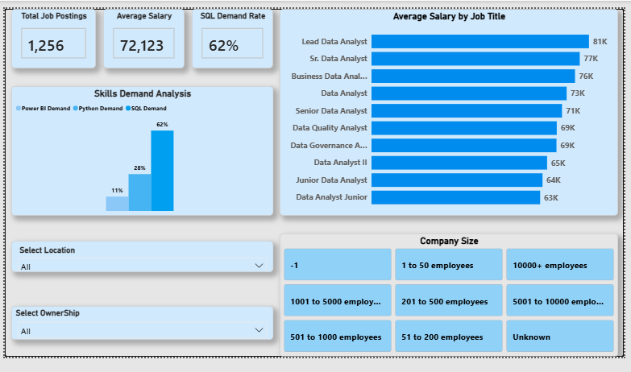

# Data Analyst Job Market Analysis Dashboard

An end-to-end data analytics project that cleans, analyzes, and visualizes the job market for data analysts. This project combines **Python** for data processing and **Power BI** for interactive dashboard creation.

## 📊 Dashboard Preview

*(Note: Drag and drop your dashboard screenshot here to display it)*

## 🛠️ Tech Stack & Tools
- **Python:** Data Cleaning & Preprocessing (Pandas, NumPy)
- **Power BI:** Data Modeling, DAX, and Interactive Dashboard Design

## 🚀 Project Steps & Workflow

### 1. Data Cleaning (Python)
The raw dataset was processed using Python to ensure high data quality:
- Handled missing and duplicate values.
- Cleaned and standardized job titles, salary columns (`min_salary`, `max_salary`, `salary_clean`).
- Extracted and engineered features for technical skills (SQL, Python, Power BI).

### 2. Interactive Dashboard (Power BI)
A professional, executive-styled dashboard was built to track key recruitment metrics:
- **KPI Cards:** Total Job Postings (1,256), Average Salary ($72,123), and SQL Demand Rate (62%).
- **Salary Insights:** Top 10 Job Titles by Average Salary (Led by Lead Data Analyst at $150K).
- **Skills Analysis:** Visualizing demand trends across core analytical skills.
- **Advanced Slicers:** Dynamic filtering using the new **Button Slicer** for Company Size, along with Location and Ownership type dropdowns.

## 💡 Key Insights & Findings
1. **High Skill Demand:** SQL is the most demanded skill in the job market, appearing in **62%** of job descriptions.
2. **Top-Paying Roles:** Leadership roles like *Lead Data Analyst* and *Sr. Data Analyst* command the highest average salaries, reaching up to **$150K**.
3. **Company Size impact:** Mid-to-large-scale enterprises offer more competitive packages compared to smaller startups.

## 📁 How to Use This Repository
- `data_cleaning.py`: The Python script used for processing the raw data.
- `Job_Market_Dashboard.pbix`: The Power BI file (download to view the interactive version).
- `/data`: Contains the datasets used.
